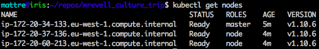
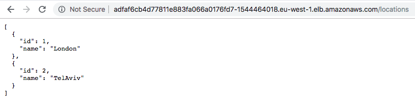
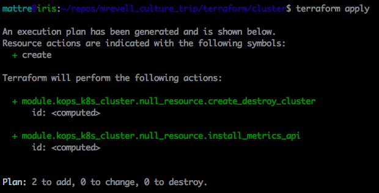
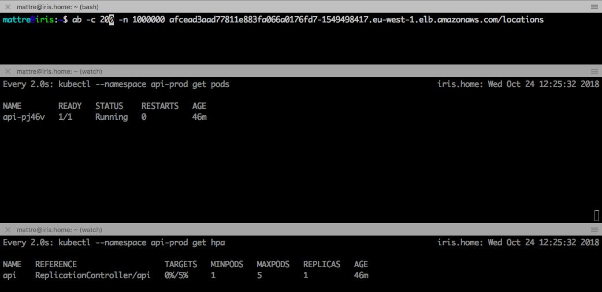
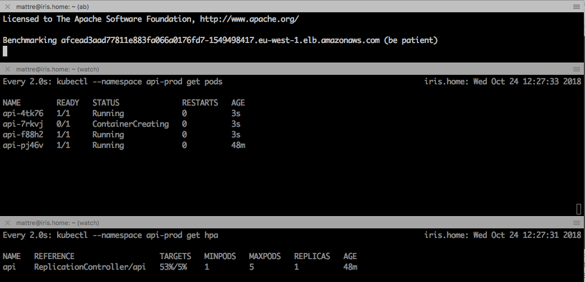
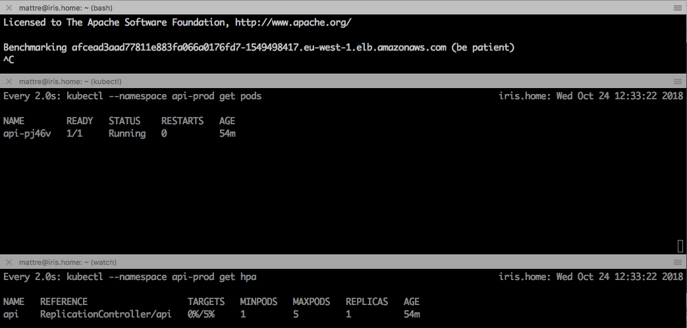
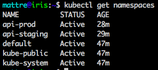
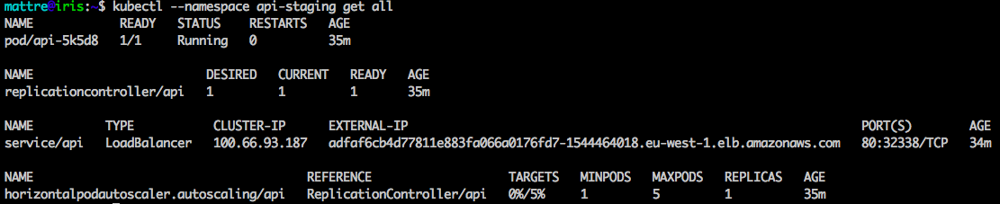
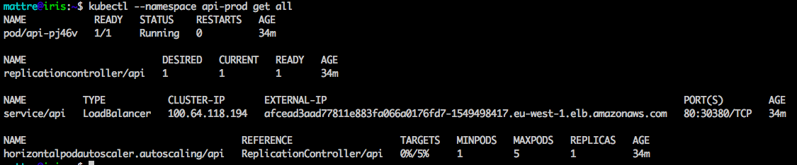

Preamble
---------

For this task I decided to deploy the application on AWS using KOPS. This struck the balance between
a managed solution, and the ability to ensure that I used only AWS Free Tier infrastructure. For
this reason, I also opted to use Gossip-based DNS for the K8s cluster to avoid needing to use R53 or
an external DNS provider.

I used Terraform to provision both the K8s cluster itself, and the API application. Even though this
is a relatively simple setup, I structured the Terraform code as I would for any complex setup:
- All resources are contained within modules
- Modules are referenced by a main manifest for each distinct piece of IaC (e.g. k8s cluster,
application deployment etc.)
- Multiple instances of the same IaC (e.g.  staging and prod environments), use the same main
manifest but are separated by using workspaces, and configured using var files.

I have included a number of screenshots in the docs to demonstrate that the cluster exists, and that
the application pods scale when put under load from Apache Benchmark.

### Limitations and known issues
- This setup only supports Kubernetes >= 1.8.x with no error checking
- There seems to be a race condition when deploying the application; occasionally TF tries to create
a resource before the namespace is available. Running apply a second time fixes the issue. It may be
that an explicit `depends_on` may be needed.

## Task Checklist

[x] Kubernetes cluster is up and running
[x] The API is up and running and returns some dummy values
[x] Automate the cluster setup through Terraform
[x] Code is accessible via GitHub

[ ] Application is available via SSL
[x] Application is auto-scaling, proven with an Apache Benchmark test
[ ] Your API is hooked up to a database
[x] Isolated staging and production environments

Installation
------------

## Prerequisites

You will need the following available:
- An AWS account with PowerUser level access
- An S3 Bucket

You will need the following to be installed and configured:
- Terraform >= 0.11.9
- kops
- kubectl
- awscli
- AWS Credentials file (~/.aws/credentials) or Env Vars set with your API key/id

## Setup
- Edit `./terraform/cluster/terraform.tfvars` to change the s3 bucket, region, and cluster name

## Deployment
To deploy the k8s cluster:
```
cd ./terraform/cluster
terraform init
terraform apply
```

To deploy the API environments:
```
cd ./terraform/api
terraform init
```
and for each:
```
terraform workspace new <env>
terraform apply -var-file=envs/<env>.tfvars
```
subsequent updates would be applied with:
```
terraform workspace select <env>
terraform apply -var-file=env/<env>.tfvars
```

Usage
-----

To connect to the application:
- Find the 'external IP' with `kubectl --namespace api-<env> get svc`
- Paste into a web browser

Task Evidence
-------------
### Kubernetes cluster is up and running


### The API is up and running and returns some dummy values


### Automate the cluster setup through Terraform


### Code is accessible via GitHub
If you're reading this, then I guess it must be!

### Application is auto-scaling, proven with an Apache Benchmark test
Ready to start the test

New pods scale out as CPU % increases

After stopping the test, the pods scale in after ~5mins


### Isolated staging and production environments
Namespaces for each environment



Staging objects

Production objects

